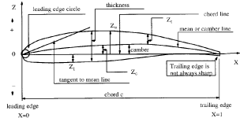
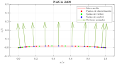
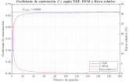
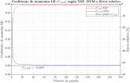
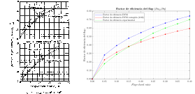
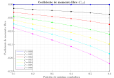
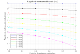

# Aerodynamics Project 1

## NACA Airfoils

The National Advisory Committee for Aeronautics (NACA), the predecessor to NASA, initiated around the 1930s a series of systematic studies to analyze the effects of the geometry of airfoils on its aerodynamic properties. This research led to the development of the NACA Airfoils. An airfoil looks something like the following (Source: [1]):

  

In this project we focus on the NACA 4-digit airfoils. According to [2], these airfoils have good stall properties and good performance at high-speeds, although the maximum lift is relatively low and the pitching moment and drag are elevated. The numering of NACA 4-digit airfoils is:

  

Further information on the NACA airfoils may be found [here](https://github.com/plosan/aerodynamics_homework_1/blob/master/notes/M1_4-Airfoils.pdf).

## Discrete Vortex Method (DVM)

The Discrete Vortex Method (DVM) is a numerical procedure to estimate some aerodynamic properties of an airfoil. The thickness distribution of the airfoil is not considered by this method, but rather the camber line, i.e. the line that approximately follows the curvature of the airfoil. Roughly speaking, this method works as follows: 

<ol>
  <li>The camber line is discretized into $N$ different panels.</li>
  <li>A lumped vortex is placed at $\frac{1}{4}$ of the length of the panel, this being responsible for the aerodynamic forces generated by the panel.</li>
  <li>The interactions between different panels vortices are accounted for.</li>
  <li>A linear system is obtained from the procedure above, the unknowns being the vorticities of panels.</li>
  <li>Once the linear system is solved, one can compute the aerodynamics loads on the airfoil.</li>
</ol> 

Further information on the DVM may be found [here](https://github.com/plosan/aerodynamics_homework_1/blob/master/notes/M2_4_Discrete_vortex_method.pdf).

## The project

The goal of the project is computing the main aerodynamic properties of the 4-digit NACA airfoils via the Discrete Vortex Method, including the effects due to flap deflection. To this end, the DVM was implemented in MATLAB and Python. Afterwards, the code was verified and validated by comparing the results to those obtained from the Thin Airfoil Theory (TAT).

The outcome of the project is the [report](https://github.com/plosan/aerodynamics_homework_1/blob/master/HW1_Cambra_dePaz_Lopez_Pujadas.pdf). This was joint work with the colleagues listed on the cover. 

The NACA-2408 airfoil is chosen to verify and validate the code. A (non-dimensional) chord length of $c = 1$ is chosen. The mean line discretization looks like the following:

  

**Verification.** Check that there are no programming errors in the code. This is achieved by comparing the results of the implemented code to the analytical results of the Thin Airfoil Theory.

Here, the lift coefficient ($C_l$) and the pitching moment coefficient wrt the leading edge ($C_{m,\text{LE}}$) were studied. 

  
  

**Validation.** Check that the simulation agrees with physical reality. This is done by comparing the code output to the experimental results.

The lift coefficient, pitching moment wrt the leading edge and the flap efficiency factor ($\partial \alpha_0 / \partial \eta$) obtained from the DVM were compared to the experimental results. (Source for the image on the left: [3])

  

**Discussion.** The free pitching moment coefficient ($C_{m0}$) and the zero-lift angle ($\alpha_{l0}$) are computed via the DVM for several values of maximum camber ($f$) and maximum camber position ($p$).

  
  

## The code

All the main files below use the DVM one way or the other to compute some aerodynamic parameters of the airfoil.

Input data:
<ol>
  <li> NACA airfoil, trailing edge flap location ($x_\text{flap}$) and flap deflection angle ($\eta$)</li>
  <li> Free stream velocity ($U_\infty$), chord length ($c$), angle of attack ($\alpha$) and reference point to compute the moment ($x_\text{ref}$)</li>
</ol> 

All main files apply the DVM to compute some aerodynamic data:
<ol>
  <li> main00.m - Solve the airfoil using DVM</li>
  <li> main01.m - Plot the convergence error</li>
  <li> main02.m - Compute the lift coefficient ($C_{l\alpha}$), the zero lift angle ($\alpha_{l0}$), and the free pitching moment coefficient ($C_{m0}$)</li>
  <li> main03.m - Computations and plots for different flap configurations</li>
  <li> main04.m - Compute the zero lift angle ($\alpha_{l0}$) and the free pitching moment coefficient ($C_{m0}$) for several values of maximum camber ($f$) and maximum camber position ($p$).</li>
</ol>

## References

[1] J. Roskam and CT. E.L. Lan. Airplane aerodynamics and performance. DAR corporation, 1997.

[2] E. Ortega. “Aerodynamic Sections”. Feb. 2020.

[3] I.H. Abbott and A.E. Von Doenhoff. Theory of wing sections: including a summary of airfoil data. Courier Corporation, 1959.